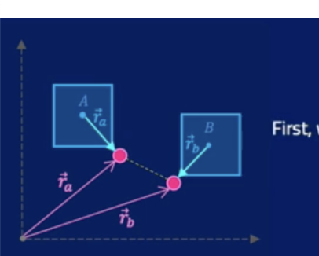

| Property | Linear | Linear Units (Metric) | Angular | Angular Units (Metric) |
|----------|--------|----------------------|---------|------------------------|
| Position | $x$ | $\text{m}$ | $\theta$ | $\text{rad}$ |
| Velocity | $v = \frac{dx}{dt}$ | $\text{m/s}$ | $\omega = \frac{d\theta}{dt}$ | $\text{rad/s}$ |
| Acceleration | $a = \frac{dv}{dt} = \frac{d^2s}{dt^2}$ | $\text{m/s}^2$ | $\alpha = \frac{d\omega}{dt} = \frac{d^2\theta}{dt^2}$ | $\text{rad/s}^2$ |
| Force | $F = ma$ | $\text{N}$ | $\tau = I\alpha$ | $\text{N}\cdot\text{m}$ |

In a game engine is then possible to determine the current state of any object based on their initial state and the force applied to it. One way of doing this is through Euler integration which something like this:

```go
// Somewhere in your game logic

weight := physics.NewWeightForce(body.Mass)
body.SumForces = body.SumForces.Add(weight)


// Integration function.
func IntegrateLinear()  {
  // a = F / m
  body.Acceleration = body.SumForces.Multiply(1.0 / body.Mass)
  // v = a . dt
  body.Velocity = body.Velocity.Add(body.Acceleration.Multiply(dt))
  // x = x . dt
  body.Position = body.Position.Add(body.Velocity.Multiply(dt))
  // Resets the forces vector for the next frame iteration
  body.SumForces = vector.Vec2{X: 0, Y: 0}
}
```

Objects can also rotate and as shown in the table above the equations are analogous to the linear momentum.

```go
func (body *Body) IntegrateAngular(dt float64) {
  // a = τ / I
	body.AngularAcceleration = body.SumTorque * (1 / (body.Shape.MomentOfInertia() * body.Mass))
  // ω = α * dt
	body.AngularVelocity += body.AngularAcceleration * dt
  // θ = ω * dt
	body.Rotation += body.AngularVelocity * dt
  // Resetting the torque force for the next frame iteration
	body.SumTorque = 0
}
```

Now there's notice how MomentOfInertia is not a property of the body object itself but a function. That is because the concept of depends of the specific shape of the object and needs to be calculated in every case. For most common shapes is already [know](https://en.wikipedia.org/wiki/List_of_moments_of_inertia).

| Shape  | Moment of Inertia Formula |
|--------|---------------------------|
| Circle | $I = \frac{1}{2}mr^2$     |
| Rectangle | $I = \frac{1}{12}m(a^2 + b^2)$ |

Another important difference is that contrary to linear movement in this case all angular properties are unidementional. This is because this is 2d engine so the change in rotation is only happening along the "invisible" z axis that points into the screen. Whereas actual linear movement is happening is two dimentions x, y.

Talking about vectors notice how they are defined simply as a pair of coordinates {X, Y} which could be confused with a point. This is because the starting point of the vector are assumed to be the particle the act on, so there not need to have another set of point to define it. The only exception to this being the actual body position which does represent the specific point occupied by the body center of mass.

From a phisical perspective most these vectors represent the state of change of a particular property. To better understand this see diagram below

[Insert diagram with a point and a v vector]

The properties of the particle A are described as:
```
x -> {X: 3, Y: 1}
V -> {X: 1, Y: 1}
```

While both of these properties are 2D vectors their meaning is different x represent the body's position while V represent the change in position the body will undertake during this frame iteration. More concretely this means that the body will travel from the postion X: 3, Y: 1 to position X: 4, Y: 2 once the velocity rate of change gets applied.

Most of the bodies properties are described as vectors thus is important to have a practical and intuitive understanding of some their properties. Given two vectors A, and B the most relevant operations 


| Operation | Formula | Intuition |
|-----------|---------|-----------|
| Addition | $\vec{A} + \vec{B} = (A_x + B_x, A_y + B_y)$ | Simply changes the state of A into B, like explained above with the body positions. Adding more vectors is like applying sequential operations to the object |
| Subtraction | $\vec{A} - \vec{B} = (A_x - B_x, A_y - B_y)$ | It gives you the vector that goes from A -> B  |
| Scalar Multiplication | $k\vec{A} = (kA_x, kA_y)$ | Scaling the vector's length by factor $k$ while preserving or reversing its direction |
| Magnitude | $\|\vec{A}\| = \sqrt{A_x^2 + A_y^2}$ | The length of the vector. In one dimention the magnitude equates to the coordinate value, this is not the case on 2+ dimentions. |
| Normal | $\vec{A}^{\perp} = (-A_y, A_x)$ | A vector perpendicular to $\vec{A}$ (rotated 90° counterclockwise). This is useful for MANY applications in physics engines such as the SAT theorem |
| Unit Vector | $\hat{A} = \frac{\vec{A}}{\|\vec{A}\|} = \frac{(A_x, A_y)}{\sqrt{A_x^2 + A_y^2}}$ | A vector with the same direction as $\vec{A}$ but with a magnitude of 1. Commonly used when only the direction is important and not the actual magnitude |
| Dot Product | $\vec{A} \cdot \vec{B} = A_x B_x + A_y B_y$ or $\|\vec{A}\|\|\vec{B}\|\cos\theta$ | Aprox projection of one vector onto another |
| Cross Product | $\vec{A} \times \vec{B} = (0, 0, A_x B_y - A_y B_x)$ | Results in a vector perpendicular to the plane containing $\vec{A}$ and $\vec{B}$ (in the positive z-direction)

# Collision
Collisions are handled in three phases
- Detection
- Collection
- Resolution

The shape of the process depends on the shape of the objects that are colliding. 

## Circle to Circle Colission

### Detection

Detecting the collision for two circles A and B is straight forward. If the distance between the two circles is less that then sum of the radia then we've encontered a collission.

$$
  \vec{d_{ba}}= (X_b - X_a), (Y_b -Y_a)\\[10pt]

  |d_{ba}| = \sqrt{(X_{ba})^2 + (Y_{ba})^2}\\[10pt]

  |d_{ba}| < R_a + R_b
$$


### Collection

Once we've detected a collision we can gather some key data about it. For two colliding circles A and B we can calculate the collission info as follows:

$$
  \hat{n_{ba}} = (Y_{ba}, - X_{ba})\\[10pt]
  start = p_b -\hat{n_{ba}} * R_b\\[10pt]
  end = p_a + \hat{n_{ba}} * R_a\\[10pt]
  depth = |end - start|
$$


This info can latter be used to resolved the collision regardless of the shapes involved.


### Resolution

The first step in the resolution consists on fixing their position so that they are not into each other anymore.

$$
  totalMass= M_a + M_b\\[10pt]
  pect_a = \frac{M_a}{totalMass}\\[10pt]
  pect_b = \frac{M_b}{totalMass} \\[10pt]
  \vec{p_a} = \vec{p_a} - \hat{n}*(depth * pect_b)\\[10pt]
  \vec{p_b} = \vec{p_b} + \hat{n}*(depth * pect_a)\\[10pt]
$$

What this means is that the displacement is inversely proportional to the mass of the object. In other words the lighter the object the more it'll get displaced and viceversa.

We can use the concept of impulse to calculate the resulting velocity of the colliding objects. This offers a more convinient way to do these calculations as oppose to go through all the Euler integrations for each object individually. With that said the underlining physics is still the same but seen from a different perspective.

Impulse is the application of a force for a given period of time 

$$ J\hat{n} = \vec{F} \cdot\ dt $$

Notice that we need to consider J along ther normal in this case the normal is the direction of collision and J is the magnitude, other way to see it is that scaling the normal vector by the maginitude of J. From there we can find an expression for the body's velocity based as a function of the impulse using Newton's Second Law of Motion 

$$ 
  J\hat{n} = m \cdot\ \vec{a} \cdot\ dt \\[10pt]
  J\hat{n} = m \cdot\ \frac{d\vec{v}}{dt} \cdot\ dt\\[10pt]
  J\hat{n} = m \cdot\ d\vec{v} \\[10pt]
  J\hat{n} = m \cdot\ (\vec{v2} - \vec{v1}) \\[10pt]
  \vec{v_f} = \vec{v_i} + \frac{J\hat{n}}{m}
$$

Now because we're dealing with collition of two bodies, say A and B, we know a couple of things
- The magnitude of the both impulse is going to be the same for both bodies but will take effect in oppose direction
- We can express both bodies final velocities as functions of the impulse

$$
  J = J_a = -J_b\\[10pt]

  (1) \quad \quad \vec{v_{fa}} = \vec{v_{ia}} + \frac{J\hat{n}}{m_a}\\[10pt] 
  (2) \quad \quad \vec{v_{fb}} = \vec{v_{ib}} - \frac{J\hat{n}}{m_b}\\[10pt]
$$

Now the problem here is that we have three unknowns $v_{fa}$, $v_{fb}$, $J$, the initial velocities and the bodies' masses are known, but we only only have 2 equations. So we need one more to be able to solve this system. Fortunately, we can also express the bodies relative velocity as a function of the bodies restitution coeficcient.

The idea is that the initial relative velocity along the normal is equal to the final relative velocity time a restitution coeficcient. In the real world some energy will be diffused in the collision so the restitution coeficcient is normally less than 1.

$$
  \vec{v_{rel}} \cdot \hat{n} = (\vec{v_a} - \vec{v_b}) \cdot \hat{n}\\[10pt]
 (3) \quad \quad (\vec{v_{fa}} - \vec{v_{fb}}) \cdot \hat{n} = - e \cdot (\vec{v_{ai}} - \vec{v_{bi}}) \cdot \hat{n}\\[10pt]
$$

Notice that `-` sign signifies a reversal in direction after the collision which makes sense because the bodies change direction to move away from each other.

We now have three equations and three unknows so the system is fully defined. Doing some algebra we can derive an expression for J as function of the $ e $, the bodies' masses and the initial velocities that looks like this:

$$
j = \frac{-(1+ e) \cdot v_{rel} \cdot \hat{n}}{\frac{1}{m_a} + \frac{1}{m_b}}
$$

After obtaining the impulse value we can then plug it into equations (1) and (2) and obtain the new velocities and consequently the new bodies positions after integrating.

## Polygon to Polygon collision

### Detection

#### Axix Aligned Bounding Box (AABB)

This refers to detecting collisions for boxes that are aligned on the X and Y axis. In terms of detection this case is trivial but it's important to know due to how common this situation presents itself. So given two AABB colliding we have

```go
xCheck :=  Aright >= Bleft && Bright >= Aleft
yCheck := Abottom <= Btop && Bbottom <= Atop

collided := xCheck && yCheck
```

#### Rotated Polygons with any amount of edges

For this we need to use a more sofisticated approach. There's the SAT algorithm

```go
// for two bodies A and B


func maxPenetration(A, B) int {
  separation = -Inf
  for idx, va in bodyA {
    maxPenetration = +Inf
    normal = bodyA.edgeAt(idx).normal()
    for vb in BodyB {
      penetration = (vb - va) . normal

      if penetration < maxPenetration {
        maxPenetration = penetration
      }
    }

    if maxPenetration > separation {
      separation = maxPenetration
    }
  }

  return separation
}

func collided(A, B) bool {
  maxPenetrationAB = maxPenetration(A, B)
  maxPenetrationBA = maxPenetration(B, A)
  
  if maxPenetrationAB > 0 || maxPenetrationBA > 0{
    return false
  }

  return true
}
```
Intuition:
This is the same idea:
- We find the deepest possible penetration
- We find the axis with the least penetration among the deepest
If the deepest possible penetration in a particular axis is still separated then the must not be colliding.

Important note: This algo does not guarantee that we find the smallest possible collision that needs to be resolved. It only guarantees that we find the most likely separating axis. When it comes to resolution we normally would like to resolved the smallest penetration but it's not strictly needed to make the engine work.

### Collection
We get the minPenetration for AB and BA we choose the smallest penetration (most positive value) because it'll be easier to resolve. The calculations change depending on which one wins, but the guiding principle is that the normal always has to flow from A -> B and which implies that we always `start` at A and `end` in B.

```go
If ab < ba {
  depth = -penetrationAB // to make it positive
  normal = edgeA.normal
  start = vertexB
  end = vertexB + edgeA.normal * depth
} else {
  depth = -penetrationBA // to make it positive
  normal = -edgeB.normal // we need to go from A -> B always.
  start = vertexA + edgeB.normal * depth
  end = vertexA
}
```

### Resolution
To properly resolve collision we also need to consider rotation and to do that we need to understand the concept of angular Impulse which while analogous to linear impulse is slightly different. We need to calculate the velocity at the point of contact which can be described as:
$$
V = v + (w \times r)
$$
Where:
- V is the velocoty at the point of contact
- v is hte linear velocity
- w is the angular velocity
- r is the vector distance from the point of contact to the center of mass.

**Axiom: w X r**

This makes sense if you put a rotating ball to move on an axis and realize that the outward rotating point reaches some points faster that the center of mass.

The idea here is to obtain an expression of the final velocities as a function of the initial state with the help of impulse. We already know the defintion of the linear velocities

$$
v_f = v_i + \frac{J\hat{n}}{m}
$$

But now we need to find a similar expression for the `w`. For that we need to consider 3 equations:

$$
1) \quad 𝜏 = r \times F\\[10pt]
2) \quad 𝜏 = Iα\\[10pt]
3) \quad J_{ang} \vec{n} = 𝜏 Δt
$$

Notice how 2 and 3 are analogous to the linear `F = M * a` and `J = F * dt` but we also need to account that the torque is a measure of how much the body is rotating which on in it self depends on where the force is being applied. if the force is applied directly in the center of mass the object won't rotate at all. The farther away we move from the center of mass the higher the torque will be. This is the intuation that's being captured by equation `1)`.

Substituting 2 into 3

$$
J_{ang}\vec{n} = I\vec{α} Δt\\[10pt]
J_{ang}\vec{n} = I\frac{\vec{Δw}}{Δt} Δt\\[10pt]
J_{ang} \vec{n}= I\vec{Δw}\\[10pt]
4) \quad \vec{w_f} = \vec{w_i} + \frac{{J_{ang}\vec{n}}}{I}
$$

Now we express $J_{ang}$ as a function of the linear impulse which we know how to calcuate already by substituing 1) into 3

$$
J_{ang}\vec{n} = r \times F Δt\\[10pt]
5) \quad J_{ang}\vec{n} = r \times J\vec{n}
$$

This above is the key insight, the angular momentum needs to account for the distance to the center of mass since it deals with rotation. So it's not quite the same as the linear momentum.

Substiuting 5 into 4

$$
\vec{w_f} = \vec{w_i} + \frac{r \times J\vec{n}}{I}
$$

**NOTE:The abov

To recap we know have
- an equation to calculate the total velocity at a point as a function of it's linear and angular velocity
- an equation for the linear velocity as a function of impulse and initial state
- an equation for angular velocity as a function of impulse and initia state

$$
V = v + (w \times r)\\[10pt]
v_f = v_i + \frac{J\hat{n}}{m}\\[10pt]
\vec{w_f} = \vec{w_i} + \frac{r \times J\vec{n}}{I}\\[10pt]
$$

Putting this together for a collission system of two objects `a` and `b` we get:

$$
\vec{V_a} = \vec{v_a} + (\vec{w_a} \times \vec{r})\\[10pt]
\vec{V_b} = \vec{v_b} + (\vec{w_b} \times \vec{r})\\[10pt]

\vec{v_{f_a}} = \vec{v_{i_a}} - \frac{J\hat{n}}{m_a}\\[10pt]
\vec{v_{f_b}} = \vec{v_{i_b}} + \frac{J\hat{n}}{m_b}\\[10pt]

\vec{w_{f_a}} = \vec{w_{i_a}} - \frac{\vec{r_a} \times J\vec{n}}{I_a}\\[10pt]
\vec{w_{f_b}} = \vec{w_{i_b}} + \frac{\vec{r_b} \times J\vec{n}}{I_b}\\[10pt]
$$

Substituting into one into the other and doing some algebra we can get the following expressions for the final Velocities as functions of the initial state and J.
$$
V_{f_a} = (v_{i_a}+ w_{i_a} \times r_a) - \frac{J\hat{n}}{m_a} - J (\frac{r_a\times \hat{n}}{I_a}) \times r_a\\[10pt]
V_{f_b} = (v_{i_b}+ w_{i_b} \times r_b) + \frac{J\hat{n}}{m_b} + J (\frac{r_b\times \hat{n}}{I_b}) \times r_b\\[10pt]

$$

We now have functions of the total velocities as a function of the initial states and the impulses but we still need to define impulse to fully described the systems. In a system of collission we also have the equation of the restitution coefficient and the relative velocity

$$
V_{rel_f}\hat{n} = -e(V_{rel_i}\hat{n})\\[10pt]
(V_{f_a} - V_{f_b}) = -e(V_{rel_i}\hat{n})\\
$$

plugging the above equations into this new one and doing the algebra to isolate J we have

$$
J  = \frac{-(1+e)(V_{rel_i} \cdot \hat{n})}{((\frac{1}{m_a} + \frac{1}{m_b}) \cdot \hat{n} + (\frac{r_a \times \hat{n}}{I_a} \times r_a ) + (\frac{r_b \times \hat{n}}{I_b} \times r_b)) \cdot \hat{n}}
$$

A further non trivial simplifying shows that:

$$
J  = \frac{-(1+e)(V_{rel_i} \cdot \hat{n})}{\frac{1}{m_a} + \frac{1}{m_b} + \frac{(r_a \times \hat{n})^2}{I_a} + \frac{(r_b \times \hat{n})^2}{I_b}}
$$

This final form is useful becasue in our 2D engine r X n is going to be treated as

# Constrains

The problem with our current approach when solving collisions is that when we resolvePenetration we just automatically move the position of the body. This is is not correct because it could mean that the body might inadvertively collide with other bodies when doing so. this causes jittering.

We need to solve the penetration in a more gradual way so that the whole system eventually converges into a point of equilibrium where the bodies are away from each other. we can do this using constrains. 

Currently, our bodies are free to move anywhere, we only force their position when they collide there are no explicit constrains determining their movement.

The constrain resolution will be based on forces. the intuitive idea is you apply forces / impulses to the bodies to "nudge" them into the right position to until the satisfy the constrain.

Constrain function (C).
inputs: bodyA, body (with all it's physical properties)
output: scalar number?

For a system where a ball should not go through a specific thredshold you need to:

$$
v_{y} = - \frac{c}{dt} * B
$$

Where
- c is the error, or distance of the body from the target
- B is the Baumgarte / bias factor. This determines how smooth we want the adjustment to be.

This makes sense, the magnitude of the correction velocity would be proportional to the error distance. The definition does not change is distance over time which is velocity. B just tells us how fast we want to converge. Slower convertions are more computative expensive but more stable??

The above was just  to get some intuition on contrains and the idea of inderectly converging as oppose to directly manipulating the position values.

Contrain Force

Its about finding internal forces that counteract the external forces applied to the object. The seminal example is the a bead in the wire, we need to find a constrain force that needs to be applied to the bead to keep it going arond the wire.

Impulse vs Force constrains

- We should not apply changes on the position directly
- We can use velocity based constrains 
- or we can use Acceleration based constrains which are based on forces
- Impulses are velocity based constrains because you ultimately define impulses as J = M * dv, which is the weighted change of velocity.

The forces would look like:

$$
\begin{bmatrix}
  a_{x} \\
  a_{y} \\
  α
\end{bmatrix} = M^{-1} * F
$$

Expanded into the matrix form

$$
\begin{bmatrix}
  \frac{1}{m} & 0 & 0\\
  0 & \frac{1}{m} & 0\\
  0 & 0 & \frac{1}{I}
\end{bmatrix}  
*
\begin{bmatrix}
  F_x\\
  F_y\\
  τ
\end{bmatrix}
$$

This is just a fancy way of expressing the calculation into the different coordinates in matrix, but it helps to see it this way because the further notations will require matrixes.

Impulses

$$
dv = M^{-1} * Fdt
$$
or


$$
\begin{bmatrix}
  \frac{1}{m} & 0 & 0\\
  0 & \frac{1}{m} & 0\\
  0 & 0 & \frac{1}{I}
\end{bmatrix}  
*
\begin{bmatrix}
  J_x\\
  J_y\\
  J_α
\end{bmatrix}
$$

So ultimately they are very similar to each other.

Now for collisions we'll have the following:

$$
\begin{bmatrix}
  \frac{1}{m_a} & 0 & 0 & 0 & 0 & 0\\
  0 & \frac{1}{m_a} & 0 & 0 & 0 & 0\\
  0 & 0 & \frac{1}{I_a}& 0 & 0 & 0\\
  0 & 0 & 0 & \frac{1}{m_b} & 0 & 0\\
  0 & 0 & 0 & 0 & \frac{1}{m_b} & 0\\
  0 & 0 & 0 & 0 & 0 & \frac{1}{I_b}
\end{bmatrix}  
*
\begin{bmatrix}
  J_{a_x}\\
  J_{a_y}\\
  J_{a_α}\\
  J_{b_x}\\
  J_{b_y}\\
  J_{b_α}
\end{bmatrix}
$$

Because the we need to consider the coordinates of both bodies.

## Generalized Velocity Constrain equation

We need to understand the chain rule. The chain helps us caculate the derivative of nested functions and with multiple variables. Given 

$$
y = f(g_{(x)}) \\[10pt]
\frac{d_y}{d_x} = f^{'}(g_{(x)}) \cdot g^{'}(x)
$$

As example

$$
y = sin(x^2)\\[10pt]
\frac{dy}{dx} = cos(x^2) \cdot 2x
$$

So it works as if we're recursively unpacking the derivatives. Now if we have a function that depends on multiple variables the general chain rule applies this way:

$$
z = f(x,y)\\[10pt]
\frac{dz}{dt} = \frac{dz}{dx} \cdot \frac{dx}{dt} + \frac{dz}{dy} \cdot \frac{dy}{dt}
$$

Applying this to our function `C(P)` we then have:

$$
\frac{dC}{dt} = \frac{dC}{dP} \cdot \frac{dP}{dt}\\[10pt]
\dot{C} = \frac{dC}{dP} \cdot \frac{dP}{dt}\\[10pt]
\dot{C} = J \cdot \dot{P}\\[10pt]
\dot{C} = J \cdot V
$$

If we only have 1 contrain and V depends on x, and y because we're working on 2D this can also be written following the chain rule for multipel vars as

$$
\dot{C} = \frac{dC}{dx} \cdot \dot{x} + \frac{dC}{dy} \cdot \dot{y}
$$

Expressing this using matrices we have
$$
\dot{C} = \begin{bmatrix}
\frac{dC}{dx} & \frac{dC}{dy}
\end{bmatrix}

\begin{bmatrix}
\dot{x}\\ 
\dot{y} 
\end{bmatrix}
$$


J stand for the jacobian which is the matrix representing the derivative of the original function with respect to all the variables it depends on

So finally we arrive again to the above expression.

$$
\dot{C} = J * V
$$
This might seem redundant but it is important. The process to solve these constrain will be the following:
- Represent our physical problem in terms of a position constraint. For example for a joint constraint between two objects we know that $P_a = P_b$ or $C = P_a - P_b = 0$ where $P_a$ and $P_b$ are the respective anchor point for both bodies.
- Then we derivate the position contraint to find the velocity constraint $\dot{C} = \dot{P_a} - \dot{P_a} = 0$
- Then we work that expression until we can isolate the velocity vector on the right side.
- That way we find the jacobian by association.


so this function needs to equate to zero to satisfy the constraint. We also add the Baumgarte coeficcient so that we can smooth out the resolution. That gives us the following 

$$
1) \quad \quad J * V + b = 0
$$

Where:
- J is the jacobian
- V is the final velocity
- b is the bias term

We can obtain the J from the contrains function and we can arbitrarily set b but we still need to find a solution for V so we need another equation. These other equation comes from the actual physical defintion of impulse which is the mass times the change in velocity.

$$
M(V_2 - V_1) = J \\[10pt] 
M(V_2 - V_1) =  L λ \\[10pt]
2) \quad \quad M(V_2 - V_1) =  J^{T} λ
$$

L λ is way to represent impulse as function of a direction vector (L) and a magnitude (λ). It so happens that the Jacobian is the representation of the gradient. The gradient is always perpendicular to the surface of the constrain and it represents the directions we have to apply the impulses to in order to nudge the bodies towards meeting the constrains. 

The jacobian can be calculated based on the constrains function which will vary depending on the problem we're solving. So we solve for V2 in the function

$$
V2 = V_1 + M^{-1}J^{T} λ
$$

then replace this into 1)

$$
J * (V_1 + M^{-1}J^{T} λ) + b = 0\\[10pt]
λ = -\frac{JV_1 + b}{JM^{-1}J^{T}}
$$

We know all these values then we can get the magnitude of the impulse and then plug back into equation 2 to get the new Bodies velocities.


## Joint constraint

Both A and B must have the same anchor point which means that ra = rb where ra and rb are supposed to be the corresponding anchor points. So `C = rb - ra = 0` but this is a vector operation which we can simplify by using the dot prouct

$$
C = (rb - ra) \cdot (rb - ra) = 0\\[10pt]
C = [(b_x - a_x) - (b_y - a_y) ] \cdot [(b_x - a_x) - (b_y - a_y) ] = 0\\[10pt]
C = [(b_x - a_x)^{2} + (b_y - a_y)^{2}] = 0\\[10pt]
$$

Because these are real numbers this means that

$$
b_x = a_x\\[10pt]
b_y = a_y\\[10pt]
b = a
$$

So basically what this does is that it reduces the problem from a vector to a scalar.

Another intuitive way to think about this is that the dot product is

$$
 v \cdot v = |v^2| * cos(0)\\[10pt]
 v \cdot v = |v^2|
$$

the only way that this is zero is that iv v is zero. In this case v is b - a. So the only way this could be zero is if b = a.


# Derivation



$$
C = (r_b - r_a) \cdot (r_b - r_a) = 0\\[10pt]
$$

Applying distributive property of the dot product

$$
(1)\quad \quad C = r_b \cdot r_b - r_b \cdot r_a - r_a \cdot r_b + r_a \cdot r_a = 0 
$$

This is the **position** constraint function but we're never going to work with the position constraint directly we need the velocity constraint which is the derivative of the above expression. Now the dot product derivative is tricky but the formula is: 

$$
(2) \quad \quad\frac{d(r \cdot s)}{dt} = r \cdot \frac{ds}{dt} + s \cdot \frac{dr}{dt}\\[10pt]
$$

Applying the above formula (2) into (1) gives gives us 4 distinct groups of expressions (one per each dot product). We can manipulate the expression until we arrive to:
$$
(3)\quad \quad \dot{C} = 2 * (r_b - r_a) \cdot \frac{dr_b}{dt} + 2 * (r_a - r_b) \frac{dr_a}{dt}
$$

Now we need to figure out what are those $\frac{dr}{dt}$ expressions. From physics we have that that the derivative of the position is the velocity. The formula of the velocity accounting for the rotating is:

$$
(4) \quad \quad \frac{dr}{dt} = v + (w \times r_{ang})
$$

This the equation of the velocity at a certain anchor point. $r_{ang}$ is the distance from the anchor point to the center of mass and $r$ is the absolute position of the anchor point. So replacing (4) into (3) we have:

$$
\dot{C} = 2(r_a - r_b) \cdot (v_a + w_a \times r_a) + 2(r_b - r_a) \cdot (v_b + w_b \times r_b)
$$
which can be further resolved into

$$
(5) \quad \quad \dot{C} = 2(r_a - r_b) \cdot v_a + 2(r_a - r_b) \cdot w_a \times r_a + 2(r_b - r_a) \cdot v_b + 2(r_b - r_a) \cdot w_b \times r_b
$$

Now we saw earlier that the general equation for the velocity constraint is

$$
(6) \quad \quad \dot{C} = JV
$$

Then it could be possible to re arrange equation (5) so that it conforms with (6) that way we can find the jacobian by association, we'll need to use some vector properties:

$$
\vec{a} \cdot (\vec{b} \times \vec{c}) = \vec{b} \cdot (\vec{c} \times \vec{a}) = \vec{c} \cdot (\vec{a} \times \vec{b})
$$

with that and an bit of algebraic manipulations we get to the following expression in terms of vector and matrices operations.

$$
\dot{C} = \begin{bmatrix}
  2*(r_a - r_b), & 2*(ra_{local} \times (r_a - r_b)), & 2*(rb-ra), & 2*(rb_{local} \times (r_b - r_a))
\end{bmatrix}
*
\begin{bmatrix}
  v_a\\
  w_a\\
  v_b\\
  w_b
\end{bmatrix}
$$

Because we were able to isolate the velocity vector then we now have an expression for the Jacobian

$$
J = \begin{bmatrix}
  2*(r_a - r_b), & 2*(r_a \times (r_{a_{local}} - r_b)), & 2*(rb-ra), & 2*(r_{r_{b_{local}}} \times (r_b - r_a))
\end{bmatrix}
$$

Notice that the jacobian is now a function of the bodies positions which we know


going back to the lamda equation

$$
λ = -\frac{JV_1 + b}{JM^{-1}J^{T}}
$$

This means that we've found J since we were able to isolate the velocities as a vector. We now need to perfom this operation to obtain the maginitude of the impulse.

In order to solve it we'll use the the form
$$
J * M^{-1} * J^{T} * λ = J * V_1 
$$

Which equates to the form

$$
A x = b
$$

where
`A = J * M^{-1} * J^{T}`, `x = λ` and `b = J * V_1`  


Future TODO:
- Multi variable calculus to be able to understand the jacobian, langrangian multiplier etc.
https://www.khanacademy.org/math/multivariable-calculus/thinking-about-multivariable-function 
- Local Space vs WorldSpace
- Cross product in 2D calculation.
